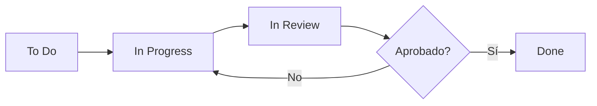

# Skill: Scrum

## Contexto

Gemini Coding Path usa una **metodología ágil simplificada** adaptada a un equipo de 2 personas.
Este skill documenta nuestras prácticas de gestión de proyecto.

---

## Estructura del Equipo

| Rol | Miembro | Responsabilidades |
|-----|---------|-------------------|
| **Product Owner** | Daikyri | Definir requisitos, priorizar backlog, aceptar entregables |
| **Scrum Master** | Hoxanfox | Gestionar flujo de trabajo, asegurar proceso, eliminar bloqueos |

> **Nota:** Ambos desarrollan. Los roles de Scrum son adicionales.

---

## Artefactos

### Product Backlog
Lista priorizada de todo lo que se quiere construir.

```markdown
## Backlog

### Alta Prioridad (Sprint 1)
1. [E02] HU-02.1: Generación Básica del Path con IA
2. [E02] HU-02.2: Persistencia del Path Generado
3. [E04] HU-04.1: Interfaz del Editor (Layout)
4. [E04] HU-04.2: Carga de Datos del Ejercicio

### Media Prioridad (Sprint 2)
5. [E01] HU-01.1: Acceso como Invitado
6. [E05] HU-05.1: Ejecución de Código en Sandbox
7. [E05] HU-05.2: Feedback de Errores

### Baja Prioridad (Sprint 3)
8. [E03] HU-03.1: Visualización del Mapa
9. [E06] HU-06.1: Sistema de XP
```

### Sprint Backlog
Items seleccionados para el sprint actual.

```markdown
## Sprint 1 (Semana 1-2)

### Objetivo
Usuario anónimo puede generar un path y ver el workspace.

### Items
- [x] Task 12: Configuración de Seguridad
- [ ] Task 1: Estructura base del backend
- [ ] Task 2: Infraestructura de BD
- [ ] Task 3: Cliente Vertex AI
- [ ] Task 4: Caso de uso GeneratePath
- [ ] Task 5: Controladores HTTP
- [ ] Task 7: Base del Frontend
- [ ] Task 8: Componente Workspace UI
- [ ] Task 9: Carga de Ejercicio
```

### Incremento
Producto funcional al final del sprint.

---

## Ceremonias

### Daily Standup (Opcional para 2 personas)
**Cuándo:** Cada día, 15 minutos  
**Formato:** Cada uno responde:
1. ¿Qué hice ayer?
2. ¿Qué haré hoy?
3. ¿Tengo algún bloqueo?

### Sprint Planning
**Cuándo:** Inicio del sprint  
**Duración:** 1-2 horas  
**Pasos:**
1. Revisar objetivo del sprint
2. Seleccionar items del backlog
3. Desglosar en tasks
4. Estimar esfuerzo
5. Asignar responsables

### Sprint Review
**Cuándo:** Final del sprint  
**Duración:** 30 minutos  
**Pasos:**
1. Demo de lo construido
2. Feedback
3. Actualizar backlog si es necesario

### Sprint Retrospective
**Cuándo:** Después de la review  
**Duración:** 30 minutos  
**Formato:**
- ¿Qué salió bien?
- ¿Qué podemos mejorar?
- ¿Qué acciones tomamos?

---

## Formato de Historia de Usuario

```markdown
# HU-XX.X: [Título Descriptivo]

**Como** [tipo de usuario],
**Quiero** [acción/funcionalidad],
**Para** [beneficio/valor].

## Criterios de Aceptación

1. **GIVEN** [contexto inicial]
   **WHEN** [acción del usuario]
   **THEN** [resultado esperado]

2. **GIVEN** [otro contexto]
   **WHEN** [otra acción]
   **THEN** [otro resultado]

## Notas Técnicas
- Consideración técnica 1
- Consideración técnica 2

## Definition of Done
- [ ] Código en main
- [ ] Tests pasan
- [ ] Code review aprobado
- [ ] Funciona en local
```

### Ejemplo Real
```markdown
# HU-02.1: Generación Básica del Path con IA

**Como** estudiante,
**Quiero** ingresar un tema en un campo de texto,
**Para** que el sistema me genere una ruta de aprendizaje personalizada.

## Criterios de Aceptación

1. **GIVEN** que estoy en la pantalla principal
   **WHEN** ingreso "Aprender Go" y presiono "Generar"
   **THEN** veo un path con 5 nodos visibles

2. **GIVEN** que el campo de texto está vacío
   **WHEN** presiono "Generar"  
   **THEN** veo un mensaje "Ingresa un tema válido"

3. **GIVEN** que Vertex AI no responde
   **WHEN** intento generar
   **THEN** veo "Servicio temporalmente no disponible"

## Notas Técnicas
- Usar Gemini 3 vía Vertex AI
- Respuesta debe ser JSON estructurado
- Timeout de 30 segundos

## Definition of Done
- [ ] Endpoint POST /paths/generate funcionando
- [ ] Tests unitarios del use case
- [ ] Frontend muestra el path generado
- [ ] Manejo de errores implementado
```

---

## Estimación

### T-Shirt Sizing

| Size | Significado | Tiempo Aproximado |
|------|-------------|-------------------|
| **XS** | Muy simple, sin incertidumbre | 1-2 horas |
| **S** | Simple, bien entendido | 2-4 horas |
| **M** | Moderado, algo de complejidad | 4-8 horas |
| **L** | Complejo, investigación necesaria | 1-2 días |
| **XL** | Muy complejo, dividir si es posible | 2+ días |

### Planning Poker (Simplificado)
1. PO presenta la historia
2. Ambos desarrolladores dicen tamaño
3. Si difieren mucho, discuten
4. Consenso final

---

## Flujo de una Task



### Columnas del Board

| Columna | Descripción |
|---------|-------------|
| **Backlog** | Items no priorizados para este sprint |
| **To Do** | Listos para empezar |
| **In Progress** | Alguien está trabajando |
| **In Review** | PR creado, esperando review |
| **Done** | Merge a main completado |

---

## Definition of Done (DoD)

Una tarea se considera **Done** cuando:

- [ ] El código está en la rama `main`
- [ ] Funciona correctamente en entorno local
- [ ] Pasa los tests (si aplica)
- [ ] Cuenta con aprobación de code review
- [ ] Documentación actualizada (si aplica)

---

## Sprint 1 - Gemini Coding Path

### Objetivo
> Un usuario anónimo puede generar una ruta de aprendizaje e ingresar al workspace de un nodo.

### Duración
7 días (ajustable según hackathon)

### Velocidad Estimada
~40-50 horas de trabajo (2 personas x ~4h/día x 7 días)

### Items Seleccionados
| Item | Responsable | Estimación |
|------|-------------|------------|
| Task 12: Seguridad | Daikyri | S |
| Task 1: Estructura backend | Daikyri | M |
| Task 2: Infraestructura BD | Daikyri | M |
| Task 3: Cliente Vertex AI | Daikyri | L |
| Task 4: GeneratePath UseCase | Daikyri | L |
| Task 5: Controllers HTTP | Daikyri | M |
| Task 7: Base frontend | Hoxanfox | S |
| Task 8: Workspace UI | Hoxanfox | L |
| Task 9: Carga de ejercicio | Hoxanfox | M |
| Task 11: Checkpoint final | Ambos | S |

---

## Checklist Scrum

- [ ] Backlog priorizado
- [ ] Sprint objetivo definido
- [ ] Tasks desglosadas y estimadas
- [ ] Responsables asignados
- [ ] Board actualizado diariamente
- [ ] DoD claro y acordado
