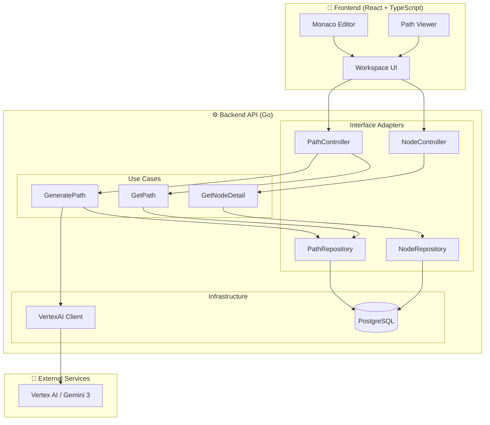
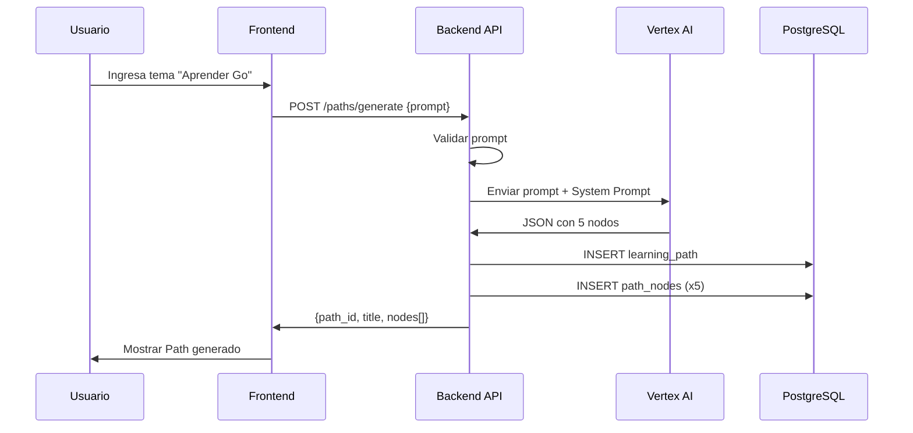

# Design Document: AI Path Generator & Workspace

## Overview

Este documento describe el diseño técnico para implementar la generación de rutas de aprendizaje mediante IA y el workspace de código en **Gemini Coding Path**. El sistema sigue Clean Architecture con un backend en Go que se integra con Vertex AI (Gemini 3) para generar contenido estructurado, y un frontend React con Monaco Editor para la experiencia de codificación.

La arquitectura separa claramente las responsabilidades:
- **Backend**: Orquesta la generación de paths, persiste datos y expone API REST
- **Vertex AI**: Genera contenido estructurado (JSON) basado en prompts del usuario
- **Frontend**: Presenta el workspace interactivo con editor de código

## Architecture



### Flujo de Generación de Path



## Components and Interfaces

### Backend Components

#### 1. PathController (HTTP Handler)

```go
// POST /api/v1/paths/generate
type GeneratePathRequest struct {
    Prompt    string `json:"prompt" binding:"required,min=3,max=500"`
    UserLevel string `json:"user_level,omitempty"` // beginner, intermediate, advanced
}

type GeneratePathResponse struct {
    PathID string         `json:"path_id"`
    Title  string         `json:"title"`
    Nodes  []NodeSummary  `json:"nodes"`
}

type NodeSummary struct {
    ID          string `json:"id"`
    Title       string `json:"title"`
    Description string `json:"description"`
    Status      string `json:"status"` // locked, unlocked
    Position    int    `json:"position"`
}

// GET /api/v1/paths/{id}
type GetPathResponse struct {
    PathID    string        `json:"path_id"`
    Topic     string        `json:"topic"`
    Title     string        `json:"title"`
    Status    string        `json:"status"`
    Nodes     []NodeSummary `json:"nodes"`
    CreatedAt time.Time     `json:"created_at"`
}
```

#### 2. NodeController (HTTP Handler)

```go
// GET /api/v1/nodes/{node_id}
type GetNodeDetailResponse struct {
    ID              string           `json:"id"`
    Title           string           `json:"title"`
    MarkdownContent string           `json:"markdown_content"`
    BoilerplateCode string           `json:"boilerplate_code"`
    Documentation   string           `json:"documentation_snippet,omitempty"`
    SecondaryMissions []Mission      `json:"secondary_missions,omitempty"`
}

type Mission struct {
    ID          string `json:"id"`
    Description string `json:"description"`
}
```

#### 3. GeneratePath Use Case

```go
type GeneratePathUseCase interface {
    Execute(ctx context.Context, userID string, prompt string, level string) (*LearningPath, error)
}

type generatePathUseCase struct {
    aiClient   AIClient
    pathRepo   PathRepository
    nodeRepo   NodeRepository
}
```

#### 4. VertexAI Client Interface

```go
type AIClient interface {
    GeneratePath(ctx context.Context, prompt string, level string) (*AIPathResponse, error)
}

type AIPathResponse struct {
    Title string       `json:"title"`
    Nodes []AINode     `json:"nodes"`
}

type AINode struct {
    Title           string `json:"title"`
    Description     string `json:"description"`
    DescriptionMD   string `json:"description_md"`
    BoilerplateCode string `json:"boilerplate_code"`
    TestsPayload    string `json:"tests_payload"`
}
```

#### 5. Repository Interfaces

```go
type PathRepository interface {
    Create(ctx context.Context, path *LearningPath) error
    GetByID(ctx context.Context, id string) (*LearningPath, error)
    GetByUserID(ctx context.Context, userID string) ([]*LearningPath, error)
}

type NodeRepository interface {
    CreateBatch(ctx context.Context, nodes []*PathNode) error
    GetByPathID(ctx context.Context, pathID string) ([]*PathNode, error)
    GetByID(ctx context.Context, id string) (*PathNode, error)
}
```

### Frontend Components

#### 1. Workspace Layout

```typescript
interface WorkspaceProps {
    nodeId: string;
}

// Layout de 3 columnas con proporciones ajustables
// - Panel Izquierdo (25%): Instrucciones en Markdown
// - Panel Central (50%): Monaco Editor
// - Panel Derecho (25%): Info/Salida
```

#### 2. Monaco Editor Configuration

```typescript
interface EditorConfig {
    language: 'go';
    theme: 'vs-dark';
    automaticLayout: true;
    minimap: { enabled: false };
    fontSize: 14;
    lineNumbers: 'on';
    scrollBeyondLastLine: false;
}
```

#### 3. API Client

```typescript
interface PathAPI {
    generatePath(prompt: string, userLevel?: string): Promise<GeneratePathResponse>;
    getPath(pathId: string): Promise<GetPathResponse>;
    getNode(nodeId: string): Promise<GetNodeDetailResponse>;
}
```

## Data Models

### Domain Entities

```go
// LearningPath representa una ruta de aprendizaje generada
type LearningPath struct {
    ID         string
    UserID     string
    Topic      string
    Title      string
    Status     PathStatus // active, completed, archived
    AIMetadata map[string]interface{}
    CreatedAt  time.Time
    Nodes      []PathNode
}

type PathStatus string

const (
    PathStatusActive    PathStatus = "active"
    PathStatusCompleted PathStatus = "completed"
    PathStatusArchived  PathStatus = "archived"
)

// PathNode representa un ejercicio dentro del path
type PathNode struct {
    ID              string
    PathID          string
    Position        int
    Title           string
    Slug            string
    DescriptionMD   string
    BoilerplateCode string
    TestsPayload    map[string]interface{}
    DocumentationMD string
    Status          NodeStatus // locked, unlocked, completed
    XPReward        int
    CreatedAt       time.Time
}

type NodeStatus string

const (
    NodeStatusLocked    NodeStatus = "locked"
    NodeStatusUnlocked  NodeStatus = "unlocked"
    NodeStatusCompleted NodeStatus = "completed"
)
```

### Database Schema

Las tablas siguen el esquema definido en la wiki (Database.md):

```sql
-- learning_paths: Almacena paths generados por usuario
-- path_nodes: Almacena nodos/ejercicios de cada path
-- Relación: learning_paths 1:N path_nodes
```

### System Prompt para Vertex AI

```text
Eres un arquitecto pedagógico experto en programación. Tu tarea es generar rutas de aprendizaje estructuradas.

REGLAS ESTRICTAS:
1. Responde ÚNICAMENTE con JSON válido, sin texto adicional
2. Genera exactamente 5 nodos de aprendizaje
3. El primer nodo siempre debe estar "unlocked", los demás "locked"
4. Cada nodo debe ser progresivamente más complejo
5. Los títulos deben ser concisos (máximo 50 caracteres)
6. Las descripciones deben ser claras (máximo 150 caracteres)

FORMATO DE RESPUESTA:
{
  "title": "Título del path (máximo 100 caracteres)",
  "nodes": [
    {
      "title": "Título del nodo",
      "description": "Descripción corta del ejercicio",
      "description_md": "# Enunciado completo en Markdown...",
      "boilerplate_code": "package main\n\n// Código inicial...",
      "tests_payload": "{\"tests\": [...]}"
    }
  ]
}
```


## Correctness Properties

*A property is a characteristic or behavior that should hold true across all valid executions of a system—essentially, a formal statement about what the system should do. Properties serve as the bridge between human-readable specifications and machine-verifiable correctness guarantees.*

### Property 1: Prompt Validation

*For any* string input as prompt, if the string is empty or contains only whitespace characters, the Backend_API should reject it with a 400 error; otherwise, it should accept the prompt for processing.

**Validates: Requirements 1.1, 1.6**

### Property 2: AI Response Structure Integrity

*For any* successful response from Vertex_AI, the parsed response should contain exactly 5 nodes, and each node should have a non-empty id, title, description, and a valid status (either "locked" or "unlocked"), with the first node always being "unlocked".

**Validates: Requirements 1.3, 1.4, 1.5**

### Property 3: Path Persistence Round-Trip

*For any* successfully generated LearningPath, retrieving it via GET /paths/{id} should return an equivalent structure with the same path_id, title, topic, and all nodes with their original positions, titles, descriptions, and statuses.

**Validates: Requirements 2.2, 2.3, 2.4**

### Property 4: Markdown Content Rendering

*For any* valid markdown_content string received from the API, rendering it in the instructions panel should produce HTML that contains all the text content from the original markdown without data loss.

**Validates: Requirements 4.2**

### Property 5: Boilerplate Code Injection

*For any* boilerplate_code string received from the API, the Monaco Editor's content should be exactly equal to the received boilerplate_code after the exercise loads.

**Validates: Requirements 4.3**

### Property 6: Node Title Display Consistency

*For any* successfully loaded node, the title displayed in the Workspace header should be exactly equal to the title field from the API response.

**Validates: Requirements 4.5**

## Error Handling

### Backend Error Handling

| Error Condition | HTTP Status | Response Body |
|----------------|-------------|---------------|
| Prompt vacío o inválido | 400 Bad Request | `{"error": "prompt is required and must be between 3-500 characters"}` |
| Path no encontrado | 404 Not Found | `{"error": "path not found"}` |
| Node no encontrado | 404 Not Found | `{"error": "node not found"}` |
| Vertex AI no disponible | 503 Service Unavailable | `{"error": "AI service temporarily unavailable"}` |
| Vertex AI timeout | 504 Gateway Timeout | `{"error": "AI service timeout"}` |
| Error interno | 500 Internal Server Error | `{"error": "internal server error"}` |

### Frontend Error Handling

| Error Condition | User Feedback |
|----------------|---------------|
| Error de red | Toast: "No se pudo conectar con el servidor. Verifica tu conexión." |
| Error 400 | Mensaje inline: "Por favor ingresa un tema válido (mínimo 3 caracteres)" |
| Error 404 | Pantalla de error: "El ejercicio no fue encontrado" |
| Error 503/504 | Toast: "El servicio de IA está temporalmente no disponible. Intenta de nuevo." |
| Error 500 | Toast: "Ocurrió un error inesperado. Intenta de nuevo." |

### Retry Strategy

- Errores 503/504: Retry automático con backoff exponencial (máximo 3 intentos)
- Errores 500: No retry automático, mostrar opción manual al usuario
- Errores 4xx: No retry, mostrar mensaje de error específico

## Testing Strategy

### Unit Tests

Los unit tests verifican ejemplos específicos y casos borde:

**Backend (Go)**:
- Validación de prompts con casos específicos (vacío, muy corto, muy largo)
- Parsing de respuestas JSON de Vertex AI
- Mapeo de entidades de dominio a DTOs
- Queries de repositorio con datos de prueba

**Frontend (TypeScript/React)**:
- Renderizado de componentes con props específicos
- Manejo de estados de carga y error
- Interacciones de usuario (clicks, inputs)

### Property-Based Tests

Los property tests verifican propiedades universales usando generación aleatoria de inputs.

**Framework**: 
- Backend: `github.com/leanovate/gopter` (Go)
- Frontend: `fast-check` (TypeScript)

**Configuración**:
- Mínimo 100 iteraciones por property test
- Cada test debe referenciar la propiedad del documento de diseño

**Property Tests a Implementar**:

1. **Property 1 (Prompt Validation)**: Generar strings aleatorios y verificar que la validación sea consistente
2. **Property 2 (AI Response Structure)**: Generar respuestas JSON y verificar estructura
3. **Property 3 (Persistence Round-Trip)**: Crear paths aleatorios, persistir y recuperar
4. **Property 4 (Markdown Rendering)**: Generar markdown válido y verificar renderizado
5. **Property 5 (Boilerplate Injection)**: Generar código Go aleatorio y verificar inyección
6. **Property 6 (Title Display)**: Generar títulos aleatorios y verificar display

### Integration Tests

- Flujo completo de generación de path (mock de Vertex AI)
- Flujo de carga de ejercicio en workspace
- Persistencia y recuperación de datos

### Test Coverage Goals

- Unit tests: 80% de cobertura de líneas
- Property tests: Todas las propiedades del documento de diseño
- Integration tests: Flujos críticos del usuario
